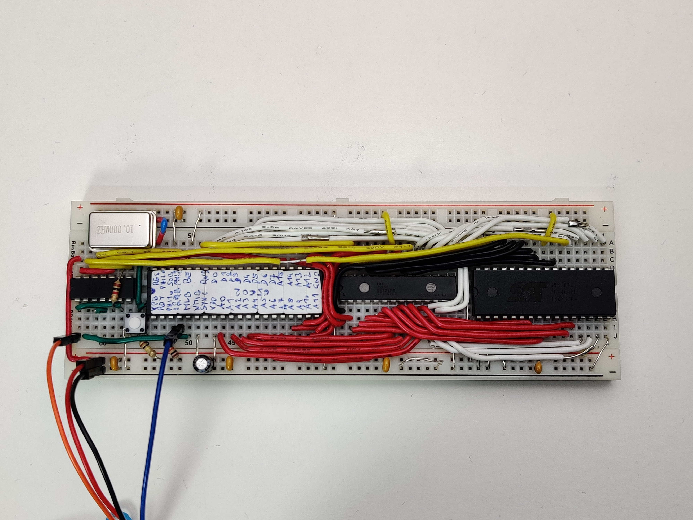

# SingleBreadboardComputer
A 65C02-based computer squeezed onto a single breadboard.

## The Challenge
Designs for SBCs based on the 6502 are quit common, but normally they use
some specialized ICs to handle the IO. I did some designs myself using 
standard 74-logic for the auxilary functionality.

Pushing the minimalist approach to the extreme, I decided to find a way 
to fit a 65C02-based computer into 5 ICs including oscillator, CPU, RAM and ROM.
To consider the system complete, it would have to meet the following 
specs:
* 65C02 CPU @10MHz
* 32K FLASH
* 32K RAM
* Software-driven I/O

## Space constraints
The BB630 board is big enough to fit the mandatory CPU/RAM/FLASH ICs and one 
additional small IC. This additional IC has to somehow implement all he
necessary logic for both the memory addressing as well as for the IO.
A quad 2-input NAND (74HC00) is a pretty versatile option here.
Some very narrow spaces between these ICs can be used for a bit of 
analog circuitry.

## Clock generator
Without dedicated space to fit the osciallator, I came up with the solution
to place it partly on the power rail. This is possible because it only has 
4 pins of which one is not even connected inside my specific part.

## Address logic
As it turns out, it is enough to use only 2 NANDs to drive the 
RAM and the FLASH in a rather unusual way. One side effect of this 
implementation is that the access time for the RAM is reduced to
only half a clock cycle, so I use an extra fast RAM here (12ns access time).

## Serial input
Receiving incoming data can be done purely in software when using the IRQB
pin of the CPU. It requires some serious cycle-counting in implementing the 
software, but It can be done somehow.

Unluckily, the SOB input pin is only edge-triggered and is unsuitable to 
implement a regular serial protocol.

## Serial output
This CPU provides the MLB pin that is intended to implement 
multi-processor systems. By using some specific CPU instructions 
(all with a read-modify-write functionality), this pin can be driven low for 
2 clock cycles at a time. 
While this is not enough to directly implement a serial output, it is one part of the 
solution. 

The other part is to use the two unused NAND-gates to implement an RS-flipflop which has
the MLB pin as its R input and the A15 address line as its S input.

The overall result of this circuit is that the CPU can drive the flipflop to its low 
state by executing one of the read-modify-write instructions on a ROM address.
And it can drive it high again by doing any access to the RAM. 
This is enough to drive a serial output signal in software

## Proof-of-concept software
I don't intend to do much more programming on this device, but I have implemented
a simple demonstration of the IO possibilities. It writes a short message to the
output and then waits for incoming bytes, which it will then write in hex digits
back to the output.

Communication is done with 115200 baud, one start bit, one stop bit.
